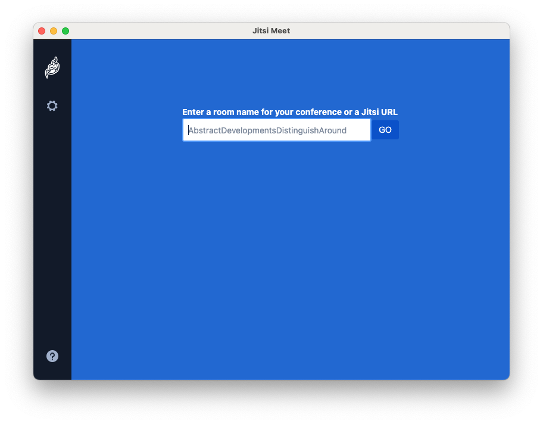

# Jitsi Meet Electron

Desktop application for [Jitsi Meet] built with [Electron].



## Features

- [End-to-End Encryption](https://jitsi.org/blog/e2ee/) support (BETA)
- Works with any Jitsi Meet deployment
- Builtin auto-updates
- ~Remote control~ (currently disabled)
- Always-On-Top window
- Support for deeplinks such as `jitsi-meet://myroom` (will open `myroom` on the configured Jitsi instance) or `jitsi-meet://jitsi.mycompany.com/myroom` (will open `myroom` on the Jitsi instance running on `jitsi.mycompany.com`)

## Installation

Download our latest release and you're off to the races!

| Windows | macOS | GNU/Linux (64-bit only) |
| -- | -- | -- |
| [Download](https://github.com/jitsi/jitsi-meet-electron/releases/latest/download/jitsi-meet.exe) | [Download](https://github.com/jitsi/jitsi-meet-electron/releases/latest/download/jitsi-meet.dmg) | [Download](https://github.com/jitsi/jitsi-meet-electron/releases/latest/download/jitsi-meet-x86_64.AppImage) |

### Homebrew

For *macOS* user, you can install the application using the following command:

```
brew cask install jitsi-meet
```

### Using it with your own Jitsi Meet installation

In order to use this application with your own Jitsi Meet installation it's
necessary to enable the External API. Your server must serve a `external_api.js`
file at the root of the installation.

Here is an example using nginx:

```
location /external_api.js {
    alias /usr/share/jitsi-meet/libs/external_api.min.js;
}
```

:warning: The following additional HTTP headers are known to break the Electron App:

```
Content-Security-Policy "frame-ancestors [looks like any value is bad]";
X-Frame-Options "DENY";
```

## Development

If you want to hack on this project, here is how you do it.

<details><summary>Show building instructions</summary>

#### Installing dependencies

Install Node.js 12 first (or if you use [nvm](https://github.com/nvm-sh/nvm), switch to Node.js 12 by running `nvm use`).

```bash
npm install
```

#### Starting in development mode

```bash
npm start
```

The debugger tools are available when running in dev mode and can be activated with keyboard shortcuts as defined here https://github.com/sindresorhus/electron-debug#features.

It can also be displayed automatically from the `SHOW_DEV_TOOLS` environment variable such as:

```bash
SHOW_DEV_TOOLS=true npm start
```

or from the application `--show-dev-tools` command line flag.

#### Building the production distribution

```bash
npm run dist
```

#### Working with jitsi-meet-electron-utils

[jitsi-meet-electron-utils] is a helper package which implements many features
such as remote control and the always-on-top window. If new features are to be
added / tested, running with a local version of these utils is very handy, here
is how to do that.

By default the jitsi-meet-electron-utils is build from its git repository
sources. The default dependency path in package.json is:

```json
"jitsi-meet-electron-utils": "jitsi/jitsi-meet-electron-utils"
```

To work with local copy you must change the path to:

```json
"jitsi-meet-electron-utils": "file:///Users/name/jitsi-meet-electron-utils-copy",
```

To build the project you must force it to take the sources as `npm update` will
not do it.

```bash
npm install jitsi-meet-electron-utils --force
```

NOTE: Also check the [jitsi-meet-electron-utils README] to see how to configure
your environment.

</details>

## Known issues

### Windows

A warning will show up mentioning the app is unsigned upon first install. This is expected.

### macOS

On macOS Catalina a warning will be displayed on first install. The app won't open unless "open" is pressed. This dialog is only shown once.
Builtin auto-updates are not yet handled in macOS due to unsigned build.

### GNU/Linux

There is a known issue which prevents the app from starting on some Linux distributions: #231

If after downloading it, you can't execute the file directly, try running `chmod u+x ./jitsi-meet-x86_64.AppImage.AppImage`

The workaround for now is to launch the app like so: `./jitsi-meet-x86_64.AppImage --no-sandbox`

<details><summary>NOTE for old GNU/Linux distributions</summary>

You might get the following error:

```
FATAL:nss_util.cc(632)] NSS_VersionCheck("3.26") failed. NSS >= 3.26 is required.
Please upgrade to the latest NSS, and if you still get this error, contact your
distribution maintainer.
```

If you do, please install NSS (example for Debian / Ubuntu):

```bash
sudo apt-get install libnss3
```

</details>

## License

Apache 2. See the [LICENSE] file.

## Community

Jitsi is built by a large community of developers, if you want to participate,
please join [community forum].

[Jitsi Meet]: https://github.com/jitsi/jitsi-meet
[Electron]: https://electronjs.org/
[latest release]: https://github.com/jitsi/jitsi-meet-electron/releases/latest
[jitsi-meet-electron-utils]: https://github.com/jitsi/jitsi-meet-electron-utils
[jitsi-meet-electron-utils README]: https://github.com/jitsi/jitsi-meet-electron-utils/blob/master/README.md
[community forum]: https://community.jitsi.org/
[LICENSE]: LICENSE
